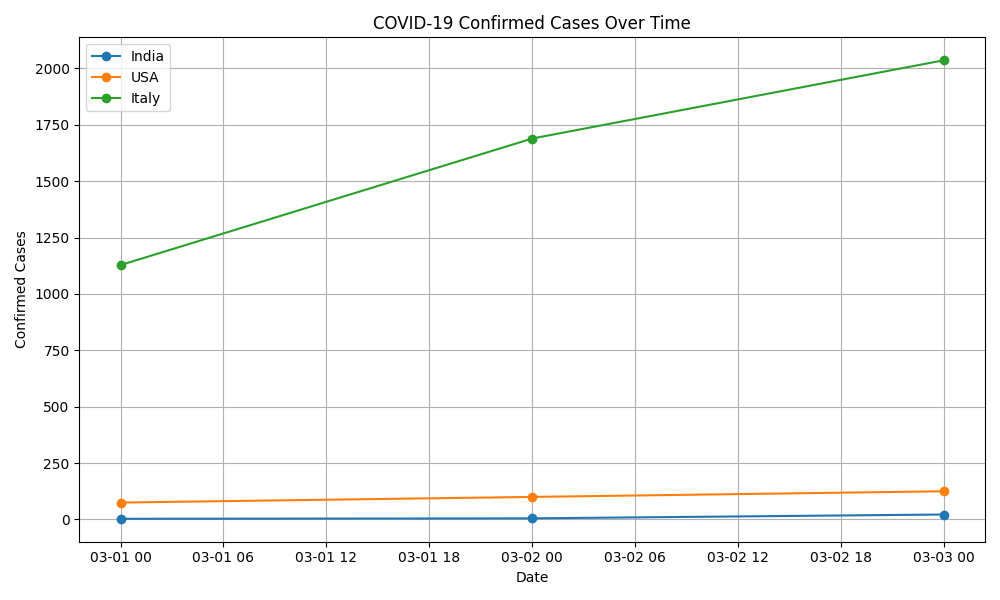
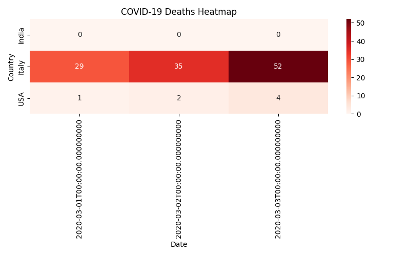

# 🌍 Project 4: COVID-19 Data Analysis

## 🎯 Objective
To analyze global COVID-19 case trends and visualize spread and death patterns over time.

## 🛠️ Tools Used
- Python
- pandas, matplotlib, seaborn

## 📁 Dataset
- Columns: Date, Country, Confirmed, Recovered, Deaths
- Countries: India, USA, Italy

## 📊 Features
- Line plot of confirmed cases across 3 countries
- Heatmap of deaths over time (per country)
- Shows early trends and risk regions

## 📸 Output
  

## 👩‍💻 Author
Suparna Chaudhari 
